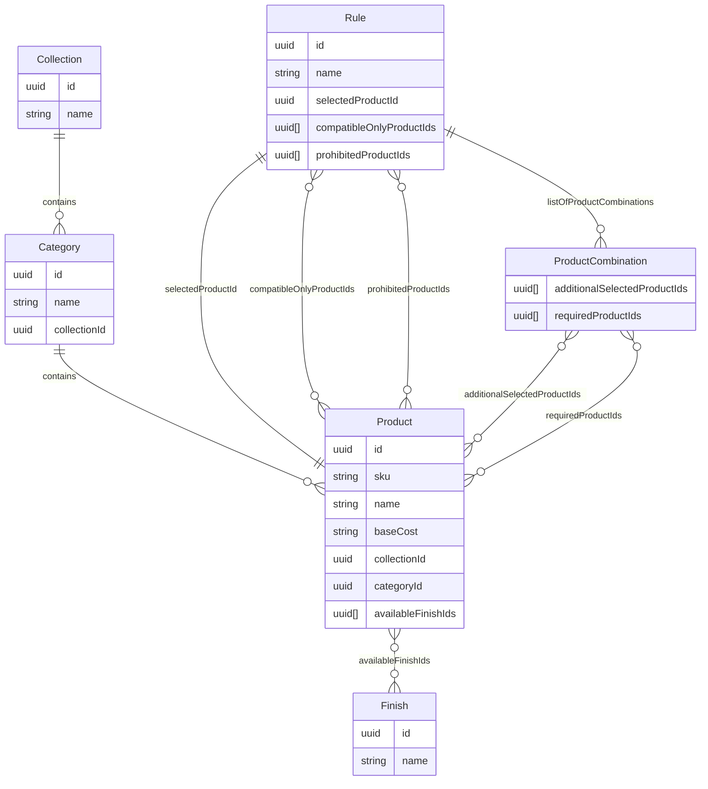
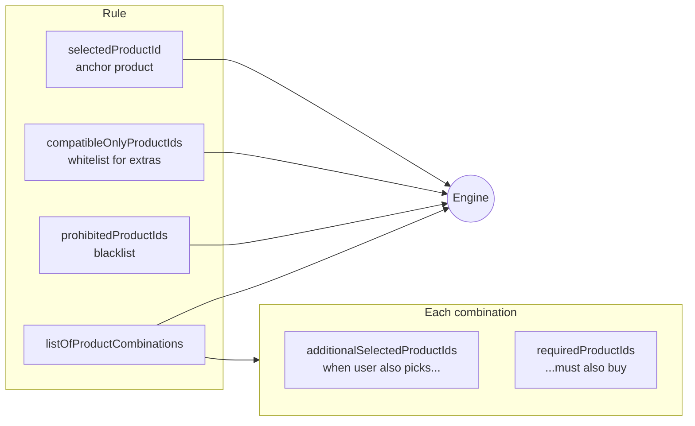
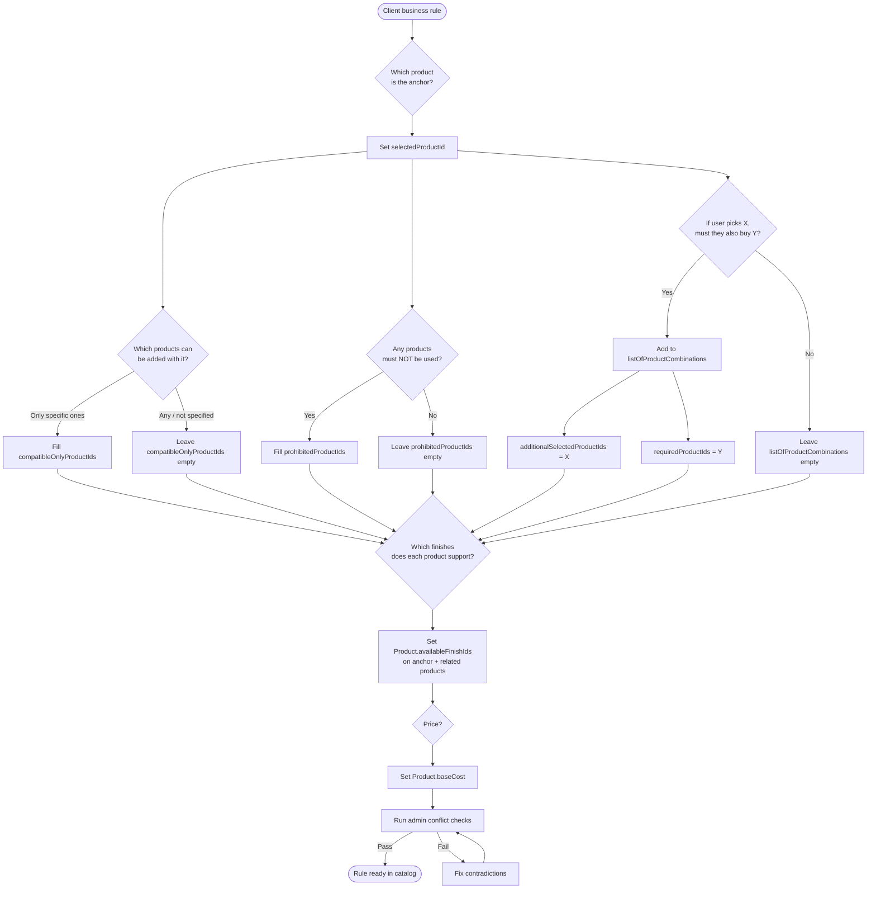
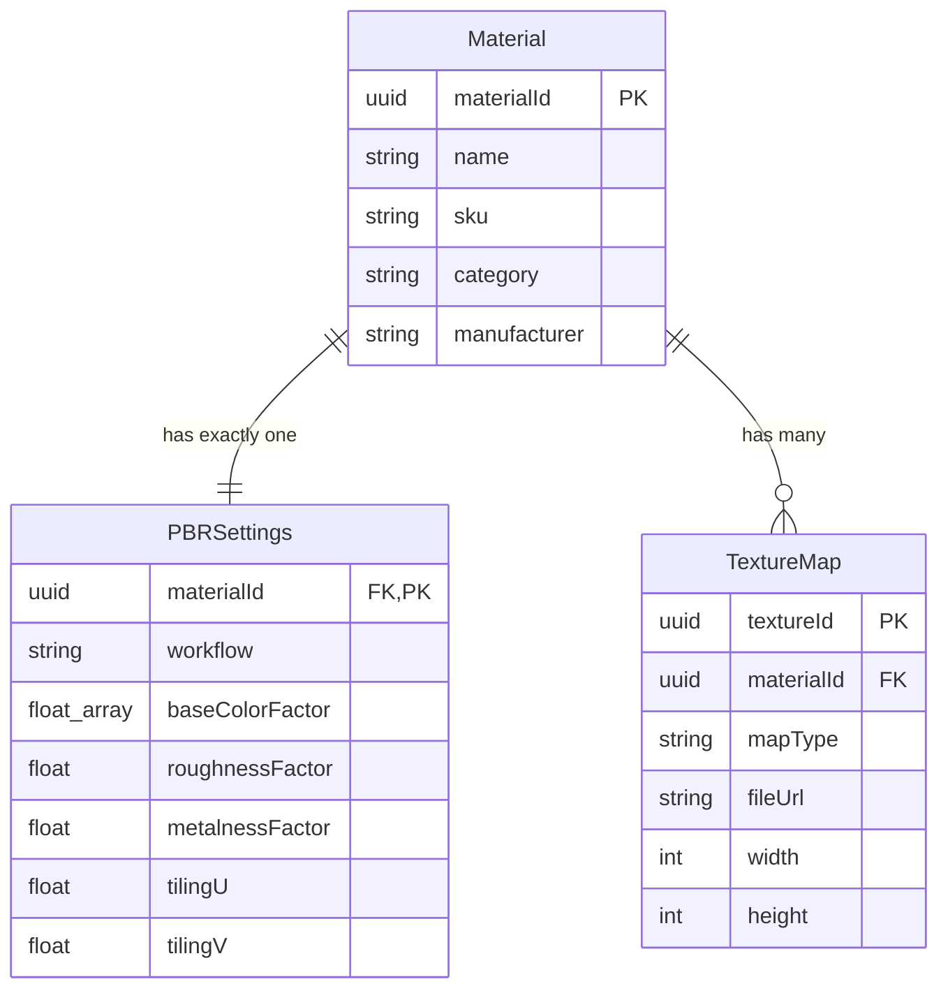
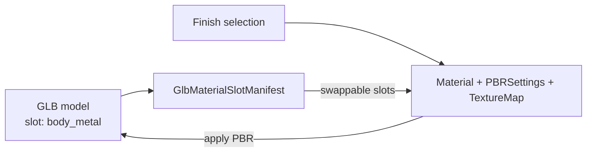
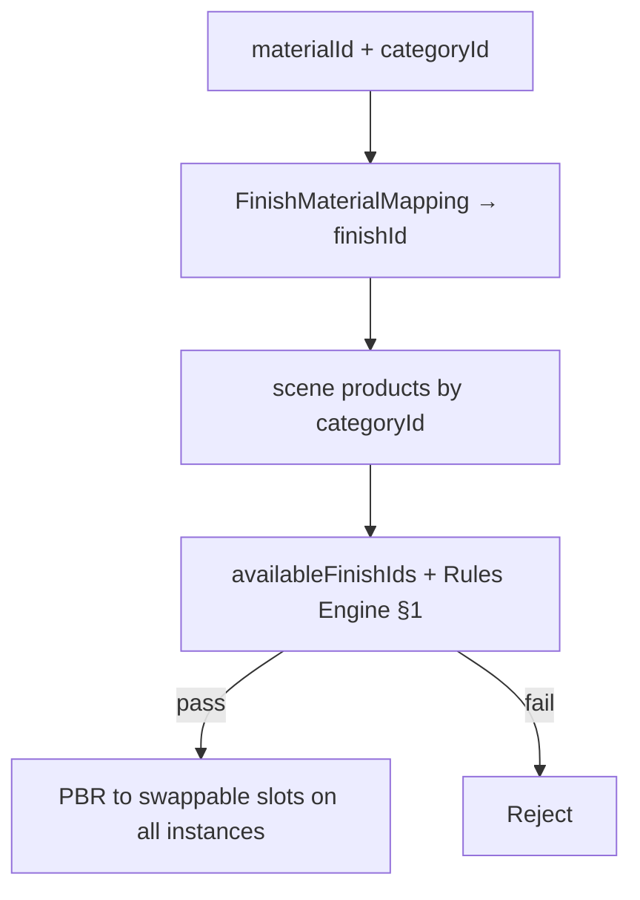

# bathroom-catalog

> **Read:** [README_RUS.md](README_RUS.md) — Russian version of the specification.

## 1. Rules Engine

### JSON Schemas

1. Collections

```json
{
  "$schema": "https://json-schema.org",
  "title": "Collection",
  "description": "Product collection (group of items in one line or style)",
  "type": "object",
  "properties": {
    "id": {
      "type": "string",
      "format": "uuid",
      "description": "PRIMARY KEY: Unique collection identifier"
    },
    "name": {
      "type": "string",
      "description": "Collection name",
      "example": "Коллекция Loft"
    }
  },
  "required": ["id", "name"]
}
```

2. Category

```json
{
  "$schema": "https://json-schema.org",
  "title": "Category",
  "description": "Product category within a collection",
  "type": "object",
  "properties": {
    "id": {
      "type": "string",
      "format": "uuid",
      "description": "PRIMARY KEY: Unique category identifier"
    },
    "name": {
      "type": "string",
      "description": "Category name",
      "example": "смеситель для раковины, душевая стойка, полотенцесушитель, раковина и т.д"
    },
    "collectionId": {
      "type": "string",
      "format": "uuid",
      "description": "FOREIGN KEY: Reference to Collection.id"
    }
  },
  "required": ["id", "name", "collectionId"]
}
```

3. Product

```json
{
  "$schema": "https://json-schema.org",
  "title": "Product",
  "description": "Catalog product (item with base price and available finishes)",
  "type": "object",
  "properties": {
    "id": {
      "type": "string",
      "format": "uuid",
      "description": "PRIMARY KEY: Unique product identifier"
    },
    "sku": {
      "type": "string",
      "description": "Manufacturer SKU",
      "example": "3197305"
    },
    "name": {
      "type": "string",
      "description": "Product name",
      "example": "смеситель для раковины, душевая стойка, полотенцесушитель, раковина и т.д"
    },
    "baseCost": {
      "type": "string",
      "description": "Base cost excluding finish (simplified representation)",
      "example": "$45"
    },
    "collectionId": {
      "type": "string",
      "format": "uuid",
      "description": "FOREIGN KEY: Reference to Collection.id"
    },
    "categoryId": {
      "type": "string",
      "format": "uuid",
      "description": "FOREIGN KEY: Reference to Category.id"
    },
    "availableFinishIds": {
      "type": "array",
      "description": "List of finishes available for this product",
      "items": {
        "type": "string",
        "format": "uuid",
        "description": "FOREIGN KEY: Reference to Finish.id"
      }
    }
  },
  "required": ["id", "name", "collectionId", "categoryId", "availableFinishIds"]
}
```

4. Finishes

```json
{
  "$schema": "https://json-schema.org",
  "title": "Finish",
  "description": "Surface finish variant for a product",
  "type": "object",
  "properties": {
    "id": {
      "type": "string",
      "format": "uuid",
      "description": "PRIMARY KEY: Unique finish identifier"
    },
    "name": {
      "type": "string",
      "description": "Finish name",
      "example": "хром, матовый чёрный, золото и др."
    }
  },
  "required": ["id", "name"]
}
```

5. Rules 

```json
{
  "$schema": "https://json-schema.org",
  "title": "Rule",
  "description": "Product compatibility rule in the configurator",
  "type": "object",
  "properties": {
    "id": {
      "type": "string",
      "format": "uuid",
      "description": "PRIMARY KEY: Unique rule identifier"
    },
    "name": {
      "type": "string",
      "description": "Human-readable rule description",
      "example": "Смеситель серии A совместим только с раковинами серии B и C"
    },
    "selectedProductId": {
      "type": "string",
      "format": "uuid",
      "description": "FOREIGN KEY: Anchor product the rule applies to"
    },
    "compatibleOnlyProductIds": {
      "type": "array",
      "description": "Whitelist: only these products can be added with the anchor",
      "items": {
        "type": "string",
        "format": "uuid",
        "description": "FOREIGN KEY: Reference to Product.id"
      }
    },
    "prohibitedProductIds": {
      "type": "array",
      "description": "Blacklist: these products cannot be used with the anchor",
      "items": {
        "type": "string",
        "format": "uuid",
        "description": "FOREIGN KEY: Reference to Product.id"
      }
    },
    "listOfProductCombinations": {
      "type": "array",
      "description": "Required add-on products when a specific combination is selected",
      "items": {
        "type": "object",
        "description": "Combination of add-on and required-to-buy products",
        "properties": {
          "additionalSelectedProductIds": {
            "type": "array",
            "description": "Add-on products selected by the user",
            "items": {
              "type": "string",
              "format": "uuid",
              "description": "FOREIGN KEY: Reference to Product.id"
            }
          },
          "requiredProductIds": {
            "type": "array",
            "description": "Products that must be added to the order",
            "items": {
              "type": "string",
              "format": "uuid",
              "description": "FOREIGN KEY: Reference to Product.id"
            }
          }
        },
        "required": ["additionalSelectedProductIds", "requiredProductIds"]
      }
    }
  },
  "required": ["id", "name", "selectedProductId", "compatibleOnlyProductIds", "prohibitedProductIds", "listOfProductCombinations"]
}

```

### Schema relationships (entity diagram)



### Rule structure (what each field does)




### Different Types of Rules

1. You select a product by using `selectedProductId`, and you can set the only compatible products for the selected product. It means that you cannot select additional products that is not in `compatibleOnlyProductIds`. Other properties like `prohibitedProductIds`, `listOfProductCombinations` can be empty.
1. There only limited number of finishes that we store in a product with `selectedProductId`and products in `compatibleOnlyProductIds` if those are specified. It means that each product in `selectedProductId` and `compatibleOnlyProductIds` can support only those finishes that we specify in property `availableFinishIds` for those products.
1. Select product `selectedProductId` has prohibited products, e.i. `prohibitedProductIds`. `compatibleOnlyProductIds` and `listOfProductCombinations` can be empty.
1. Last type of rule is when a user selects additional products aka  `listOfProductCombinations.additionalSelectedProductIds`, and for compination of products `selectedProductId` and `additionalSelectedProductIds` we require to buy products: `requiredProductIds`. In simple case, `additionalSelectedProductIds` is just one element and `requiredProductIds` is one element as it's mentioned in the task. But in real life, it can be more complex, so let's design our system for combination with any number of products.

All these rules must be consistent, meaning `prohibitedProductIds` cannot contains products in `compatibleOnlyProductIds` and vice versa. Also products in `listOfProductCombinations` don't contradict logically products in `prohibitedProductIds` and `compatibleOnlyProductIds`. Otherwise, our Engine throws admin error and requires us to fix the error.

### How Engine Works on Checking compatiblity of selected products and finishes

**INPUT**
1. User selects a product with 'input.selectedProductId'.
1. User **may or may not** selects additional products as array of `input.additionalSelectedProductIds`.
1. User selects a finish with 'input.selectedFinishId'.

**ENGINE PROCESS**
1. Engine filters all the rules by `input.selectedProductId` and `input.additionalSelectedProductIds`.
1. Engine validates all those rules individually and all together for like in Conflicts Resolution Section.

For each rule:
1. Enigne gets `availableFinishIds` from product with `input.selectedProductId`.
1. Engine checks all products from `input.additionalSelectedProductIds`, and gets all their `availableFinishIds`.
1. Engine checks all `compatibleOnlyProductIds`. And if there are some in `input.additionalSelectedProductIds` that don't match `compatibleOnlyProductIds`, we inform a user about incompitability or we refuse the order.
1. Engine checks `prohibitedProductIds`. If there any products are matching `input.selectedProductId` and any of `input.additionalSelectedProductIds` we refuse the order.
1. Engine checks `listOfProductCombinations` (if a user selects additional products) and then it checks whether a user required to buy products (`requiredProductIds`). If everything is okay we get their `availableFinishIds`, otherwise we require to add those things to the order.
1. Engine checks if all products in combination support 'input.selectedFinishId'. If yes, the finish is compatible with user order, otherwise no.
1. Also engine can calculate total cost of selected product with finishes combined. It's a separate process, and it's out of scope of this task.

### How to Transfer Client Rule to our Schema for Rules.

1. For each input product, we should choose the only compatible products. It does not really matter from which collections those products are from. For example, product **A** from collection **1** potentillay can be only compatible from product **B** in collection **2**. It's just for the flexibility at zero cost.
2. Each product must support certain finishes and have a base cost.
3. Each product can have prohibited products, then we paste them in `prohibitedProductIds`.
4. And finally each product if order with certain products must require additional products aka `listOfProductCombinations.requiredProductIds`



### Conflicts Resolution

#### Empty lists mean
1. If `compatibleOnlyProductIds` is empty, the user can pick any additional product (unless it is prohibited).
1. If `prohibitedProductIds` is empty, nothing is blocked by this rule.
1. If `listOfProductCombinations` is empty, this rule does not require any extra products.

#### Individual Rule Check (for admins)
1. A product cannot be in both `compatibleOnlyProductIds` and `prohibitedProductIds`.
1. `selectedProductId` cannot be in `prohibitedProductIds`.
1. `selectedProductId` should not be in `compatibleOnlyProductIds`.
1. Products in `additionalSelectedProductIds` cannot be in `prohibitedProductIds`.
1. Products in `requiredProductIds` cannot be in `prohibitedProductIds`.
1. If `compatibleOnlyProductIds` is not empty, every `additionalSelectedProductIds` entry must be inside `compatibleOnlyProductIds`.
1. The same `additionalSelectedProductIds` set cannot appear twice with different `requiredProductIds`.
1. All product IDs in the rule must exist in the product catalog.

If any check fails, the engine throws an admin error and the rule must be fixed before use.

#### Two or more rules with the same `selectedProductId` (for admin)
1. A product allowed in one rule’s `compatibleOnlyProductIds` cannot be in another rule’s `prohibitedProductIds` for the same `selectedProductId`.
2. If two rules both have `compatibleOnlyProductIds`, their lists must share at least one product. If the overlap is empty, no additional product can satisfy both rules.
3. Two rules cannot require different `requiredProductIds` for the same `additionalSelectedProductIds` set.
4. A product required by one rule cannot be prohibited by another rule for the same `selectedProductId`.

If any check fails, the engine throws an admin error and the rules must be fixed before use.


## 2. Finish Configuration

### JSON Schemas

1. Material:

```json
{
  "$schema": "http://json-schema.org/draft-07/schema#",
  "title": "Material",
  "description": "Main finishing material entity (parent table)",
  "type": "object",
  "properties": {
    "materialId": {
      "type": "string",
      "format": "uuid",
      "description": "PRIMARY KEY: Unique material identifier"
    },
    "name": {
      "type": "string",
      "description": "Material name",
      "example": "Дуб Натур Браш"
    },
    "sku": {
      "type": "string",
      "description": "Material SKU",
      "example": "WD-OAK-042"
    },
    "category": {
      "type": "string",
      "description": "Material category (wood, metal, etc.)",
      "example": "Дерево / Паркет"
    },
    "manufacturer": {
      "type": "string",
      "description": "Material manufacturer",
      "example": "Barlinek"
    }
  },
  "required": ["materialId", "name", "sku", "category", "manufacturer"],
  "additionalProperties": false
}
```

2. PBRSettings

```json
{
  "$schema": "http://json-schema.org/draft-07/schema#",
  "title": "PBRSettings",
  "description": "Physical rendering parameters (1:1 link to Material)",
  "type": "object",
  "properties": {
    "materialId": {
      "type": "string",
      "format": "uuid",
      "description": "FOREIGN KEY: Reference to Material.materialId"
    },
    "workflow": {
      "type": "string",
      "enum": ["metallicRoughness", "specularGlossiness"],
      "description": "PBR rendering workflow",
      "default": "metallicRoughness"
    },
    "baseColorFactor": {
      "type": "array",
      "description": "Material base color [R, G, B, A]",
      "minItems": 4,
      "maxItems": 4,
      "items": {
        "type": "number",
        "minimum": 0.0,
        "maximum": 1.0
      },
      "default": [1.0, 1.0, 1.0, 1.0]
    },
    "roughnessFactor": {
      "type": "number",
      "description": "Roughness factor (0 = smooth, 1 = matte)",
      "minimum": 0.0,
      "maximum": 1.0,
      "default": 0.5
    },
    "metalnessFactor": {
      "type": "number",
      "description": "Metalness factor (0 = dielectric, 1 = metal)",
      "minimum": 0.0,
      "maximum": 1.0,
      "default": 0.0
    },
    "tilingU": {
      "type": "number",
      "description": "Texture tiling on U axis",
      "default": 1.0
    },
    "tilingV": {
      "type": "number",
      "description": "Texture tiling on V axis",
      "default": 1.0
    }
  },
  "required": [
    "materialId", 
    "workflow", 
    "baseColorFactor", 
    "roughnessFactor", 
    "metalnessFactor"
  ],
  "additionalProperties": false
}
```

3. TextureMap

```json
{
  "$schema": "http://json-schema.org/draft-07/schema#",
  "title": "TextureMap",
  "description": "Texture map file (1:N link to Material)",
  "type": "object",
  "properties": {
    "textureId": {
      "type": "string",
      "format": "uuid",
      "description": "PRIMARY KEY: Unique texture file ID"
    },
    "materialId": {
      "type": "string",
      "format": "uuid",
      "description": "FOREIGN KEY: Reference to Material.materialId"
    },
    "mapType": {
      "type": "string",
      "enum": ["albedo", "normal", "roughness", "metallic", "ambientOcclusion", "displacement"],
      "description": "Texture type (channel)",
    },
    "fileUrl": {
      "type": "string",
      "format": "uri",
      "description": "Direct link to S3 storage",
      "example": "https://storage.yandexcloud.net/assets/oak_normal.jpg"
    },
    "width": {
      "type": "integer",
      "description": "Texture width in pixels",
      "minimum": 1,
      "example": 2048
    },
    "height": {
      "type": "integer",
      "description": "Texture height in pixels",
      "minimum": 1,
      "example": 2048
    }
  },
  "required": ["textureId", "materialId", "mapType", "fileUrl"],
  "additionalProperties": false
}
```

### Diagram:



### GlbMaterialSlotManifest

A **GLB** file is the binary container for glTF — a single 3D asset (geometry, materials, textures) used by the configurator. **Material slots** are named surfaces inside the GLB. Slot names are the contract between the artist (who exports the model) and the developer (who swaps finishes at runtime).

```json
{
  "$schema": "http://json-schema.org/draft-07/schema#",
  "title": "GlbMaterialSlotManifest",
  "description": "GLB model material slot manifest (links product to 3D asset and finish swap rules)",
  "type": "object",
  "properties": {
    "manifestId": {
      "type": "string",
      "format": "uuid",
      "description": "PRIMARY KEY: Unique manifest identifier"
    },
    "productSku": {
      "type": "string",
      "description": "FOREIGN KEY: Product SKU (Product.sku) the model is bound to"
    },
    "glbUrl": {
      "type": "string",
      "format": "uri",
      "description": "Direct link to GLB file in storage",
      "example": "https://storage.yandexcloud.net/models/faucet_loft_3197305.glb"
    },
    "slots": {
      "type": "array",
      "description": "List of model material slots",
      "minItems": 1,
      "items": {
        "type": "object",
        "title": "MaterialSlot",
        "description": "One named material slot in the GLB",
        "properties": {
          "slotName": {
            "type": "string",
            "pattern": "^[a-z][a-z0-9]*(_[a-z0-9]+)*$",
            "description": "Slot name in GLB (materials[].name). Format: snake_case, Latin, lowercase",
            "example": "body_metal"
          },
          "swappable": {
            "type": "boolean",
            "description": "Whether finish can be swapped on this slot when a Finish is selected"
          },
          "defaultFinishId": {
            "type": "string",
            "format": "uuid",
            "description": "FOREIGN KEY: Default finish (Finish.id). Required when swappable = true"
          }
        },
        "required": ["slotName", "swappable"],
        "additionalProperties": false
      }
    }
  },
  "required": ["manifestId", "productSku", "glbUrl", "slots"],
  "additionalProperties": false
}
```

Example:

```json
{
  "manifestId": "a1b2c3d4-e5f6-7890-abcd-ef1234567890",
  "productSku": "3197305",
  "glbUrl": "https://storage.yandexcloud.net/models/faucet_loft_3197305.glb",
  "slots": [
    { "slotName": "body_metal", "swappable": true, "defaultFinishId": "f1a2b3c4-d5e6-7890-abcd-ef1234567890" },
    { "slotName": "handle_metal", "swappable": true, "defaultFinishId": "f1a2b3c4-d5e6-7890-abcd-ef1234567890" },
    { "slotName": "spout_metal", "swappable": true, "defaultFinishId": "f1a2b3c4-d5e6-7890-abcd-ef1234567890" },
    { "slotName": "aerator_plastic_fixed", "swappable": false }
  ]
}
```

### Naming convention

| Rule | Good | Bad |
|---|---|---|
| English, lowercase, `snake_case` | `body_metal` | `Material.001`, `Chrome_Body` |
| Name by **role**, not by finish | `handle_metal` | `chrome_handle`, `gold_body` |
| Swappable slots: suffix `_metal` or `_finish` | `spout_metal` | `spout` |
| Fixed slots: suffix `_fixed` | `basin_ceramic_fixed` | `basin_white` |
| Same slot names across product variants in a series | all faucets use `body_metal` | `body` on one model, `Body_Metal` on another |

### Logical behaviour

**Artist**
1. Split the model into material regions and assign placeholder materials using the agreed slot names.
2. Export as GLB (glTF 2.0, PBR metallic-roughness). Every `materials[].name` must match a `slotName` in the manifest exactly.
3. Ship the GLB together with a `GlbMaterialSlotManifest` for the product SKU.
4. Do not bake finish names into slot names — finish is runtime data from the `Finish` / `Material` catalog.

**Developer**
1. Load the GLB and read `materials[].name` from the glTF scene.
2. Load `GlbMaterialSlotManifest` by `productSku` and validate: every manifest `slotName` exists in the GLB; no unnamed materials (`Material.001`) in production assets.
3. On finish change: for each slot where `swappable === true`, resolve `selectedFinishId` → `Material` + `PBRSettings` + `TextureMap[]`, then apply to the matching GLB slot.
4. Slots with `swappable === false` or suffix `_fixed` are never overridden at runtime.
5. Reject the asset at CI / admin review if manifest and GLB slot names diverge.

**Runtime flow**



### Application mechanism

User picks a **material** (`materialId`). The system links it to a `Finish`, checks product compatibility via Rules Engine (§1), then applies PBR to all matching instances in the scene at once.

**1. FinishMaterialMapping** — connects render material to catalog finish:

```json
{
  "$schema": "http://json-schema.org/draft-07/schema#",
  "title": "FinishMaterialMapping",
  "description": "Material ↔ Finish link (materialId input → finishId for validation)",
  "type": "object",
  "properties": {
    "finishId": {
      "type": "string",
      "format": "uuid",
      "description": "FOREIGN KEY: Reference to Finish.id"
    },
    "materialId": {
      "type": "string",
      "format": "uuid",
      "description": "FOREIGN KEY: Reference to Material.materialId"
    }
  },
  "required": ["finishId", "materialId"],
  "additionalProperties": false
}
```

**2. ApplyMaterialToScene** — input for scene-wide apply:

```json
{
  "$schema": "http://json-schema.org/draft-07/schema#",
  "title": "ApplyMaterialToScene",
  "description": "Apply material to all products of the given type in the scene",
  "type": "object",
  "properties": {
    "materialId": {
      "type": "string",
      "format": "uuid",
      "description": "FOREIGN KEY: Selected material (Material.materialId)"
    },
    "categoryId": {
      "type": "string",
      "format": "uuid",
      "description": "FOREIGN KEY: Product type in scene (Category.id), e.g. all faucets"
    },
    "selectedProductId": {
      "type": "string",
      "format": "uuid",
      "description": "FOREIGN KEY: Order anchor product (for Rules Engine)"
    },
    "additionalSelectedProductIds": {
      "type": "array",
      "description": "Additional products in the order",
      "items": { "type": "string", "format": "uuid" }
    },
    "sceneProductIds": {
      "type": "array",
      "description": "Products placed in the 3D scene",
      "items": {
        "type": "string",
        "format": "uuid",
        "description": "FOREIGN KEY: Reference to Product.id"
      }
    }
  },
  "required": ["materialId", "categoryId", "selectedProductId", "additionalSelectedProductIds", "sceneProductIds"],
  "additionalProperties": false
}
```

**Behaviour**
1. `materialId` → `FinishMaterialMapping` → `finishId`.
2. Filter `sceneProductIds` where `Product.categoryId === categoryId`.
3. **Compatibility**: for each filtered product, `finishId` must be in `Product.availableFinishIds`; then call Rules Engine (§1) with `selectedFinishId = finishId` — if rejected, stop.
4. **Apply**: for each compatible instance, load `GlbMaterialSlotManifest` → resolve `Material` + `PBRSettings` + `TextureMap[]` → apply to all `swappable` slots in one pass.



### Extensibility (config-only new finish)

The applicator, rules checks, and GLB loader are **finish-agnostic** — they read catalog config at runtime. Adding a finish = adding records, no deploy.

**Checklist — what to add when introducing a new finish (e.g. "Brushed Nickel"):**

| # | Config record | Schema | Required? | Why |
|---|---|---|---|---|
| 1 | `Finish` | §1 | yes | Catalog entry users pick |
| 2 | `Material` | §2 | yes | Render payload for 3D |
| 3 | `PBRSettings` | §2 | yes | Roughness, metalness, color, tiling |
| 4 | `TextureMap[]` | §2 | yes* | Albedo, normal, roughness, etc. (*or flat color via `baseColorFactor` only) |
| 5 | `FinishMaterialMapping` | above | yes | Links `finishId` ↔ `materialId` for apply flow |
| 6 | `Product.availableFinishIds` | §1 | yes | Add `finishId` to every product that supports it |

**Not required**
- GLB re-export — slot names (`body_metal`, …) stay the same
- `GlbMaterialSlotManifest` changes — only update `defaultFinishId` if this finish is the new default
- Code changes — renderer resolves any `materialId` the same way
- `Rule` changes — only if the new finish affects product compatibility logic

**Example — minimal config bundle for one new finish:**

```json
{
  "finish": {
    "id": "f-new-001",
    "name": "Брашированный никель"
  },
  "material": {
    "materialId": "m-new-001",
    "name": "Brushed Nickel PBR",
    "sku": "MT-BN-001",
    "category": "Металл",
    "manufacturer": "In-house"
  },
  "pbrSettings": {
    "materialId": "m-new-001",
    "workflow": "metallicRoughness",
    "baseColorFactor": [0.75, 0.75, 0.72, 1.0],
    "roughnessFactor": 0.45,
    "metalnessFactor": 1.0
  },
  "textureMaps": [
    { "textureId": "t-001", "materialId": "m-new-001", "mapType": "albedo", "fileUrl": "https://storage.example.com/bn_albedo.jpg" },
    { "textureId": "t-002", "materialId": "m-new-001", "mapType": "normal", "fileUrl": "https://storage.example.com/bn_normal.jpg" }
  ],
  "finishMaterialMapping": {
    "finishId": "f-new-001",
    "materialId": "m-new-001"
  },
  "productsToUpdate": [
    { "productId": "p-faucet-loft", "availableFinishIds": ["…existing…", "f-new-001"] }
  ]
}
```

**Behaviour**
1. Admin uploads config → new finish appears in picker for products that list it.
2. User selects material → existing `ApplyMaterialToScene` flow handles it.
3. Same pipeline for every finish: mapping → compatibility → PBR apply.

### Integration with Rules Engine (§1)

1. **Source of finish limits** — `Product.availableFinishIds` (§1) defines which finishes each product supports.
2. **UI picker** — show only finishes that appear in `availableFinishIds` of **every** product in the current order (`selectedProductId` + `additionalSelectedProductIds`).
3. **materialId → finishId** — before any check, resolve via `FinishMaterialMapping`.
4. **Engine input** — pass `selectedProductId`, `additionalSelectedProductIds`, `selectedFinishId` (same as §1 engine input).
5. **Product rules first** — engine validates `compatibleOnlyProductIds`, `prohibitedProductIds`, `listOfProductCombinations` (unchanged from §1).
6. **Finish check** — engine verifies `selectedFinishId` is in `availableFinishIds` of anchor + all additional products (and any `requiredProductIds` from combinations).
7. **Scene apply gate** — `ApplyMaterialToScene` runs only if engine returns pass; otherwise block and show message.
8. **Per-instance check** — each scene product must also list the `finishId` in its own `availableFinishIds` (a product in the scene may support fewer finishes than the order allows).
9. **No duplicate logic** — §2 never re-implements rules; it delegates to §1 engine, then applies PBR.


