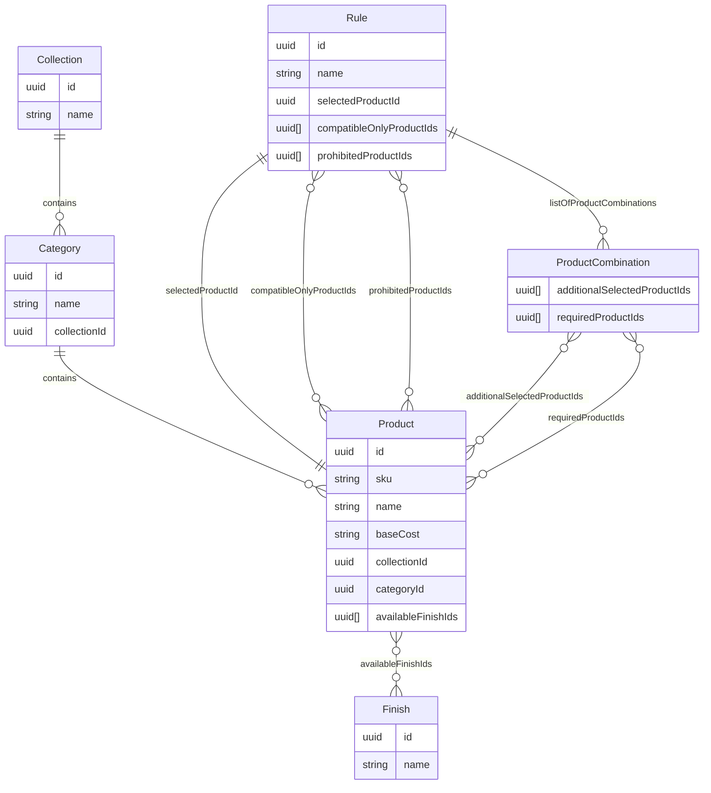
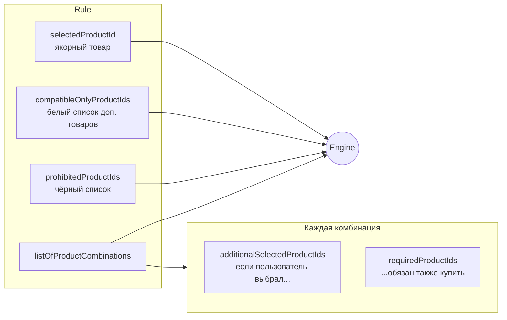
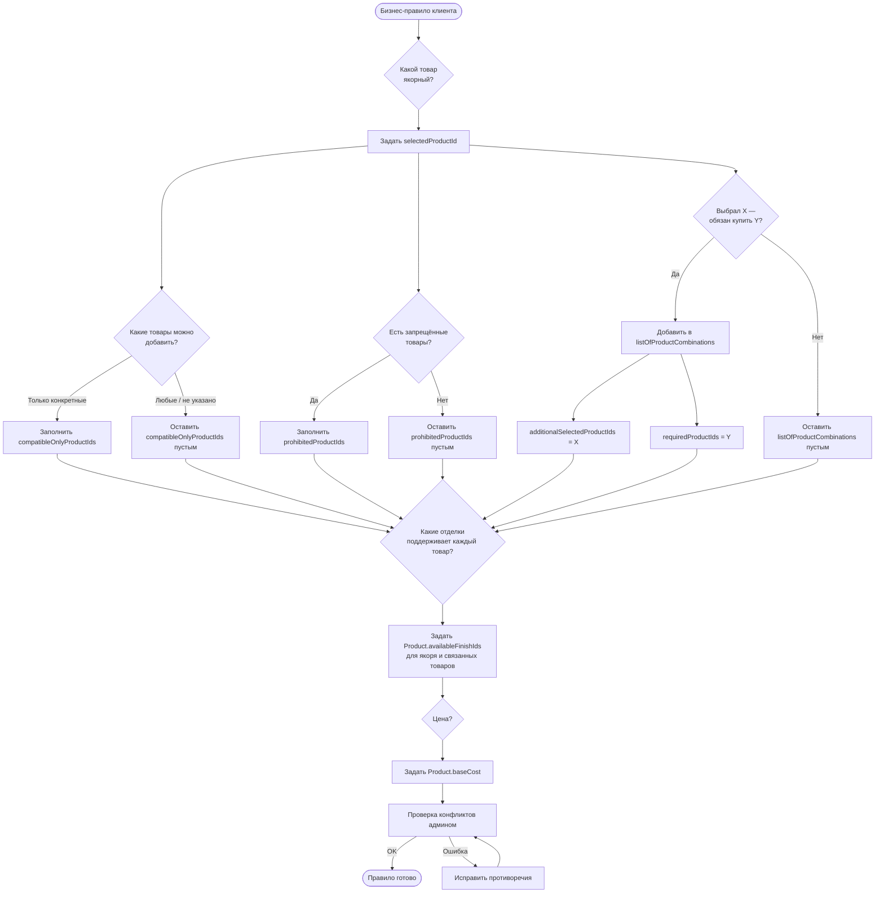
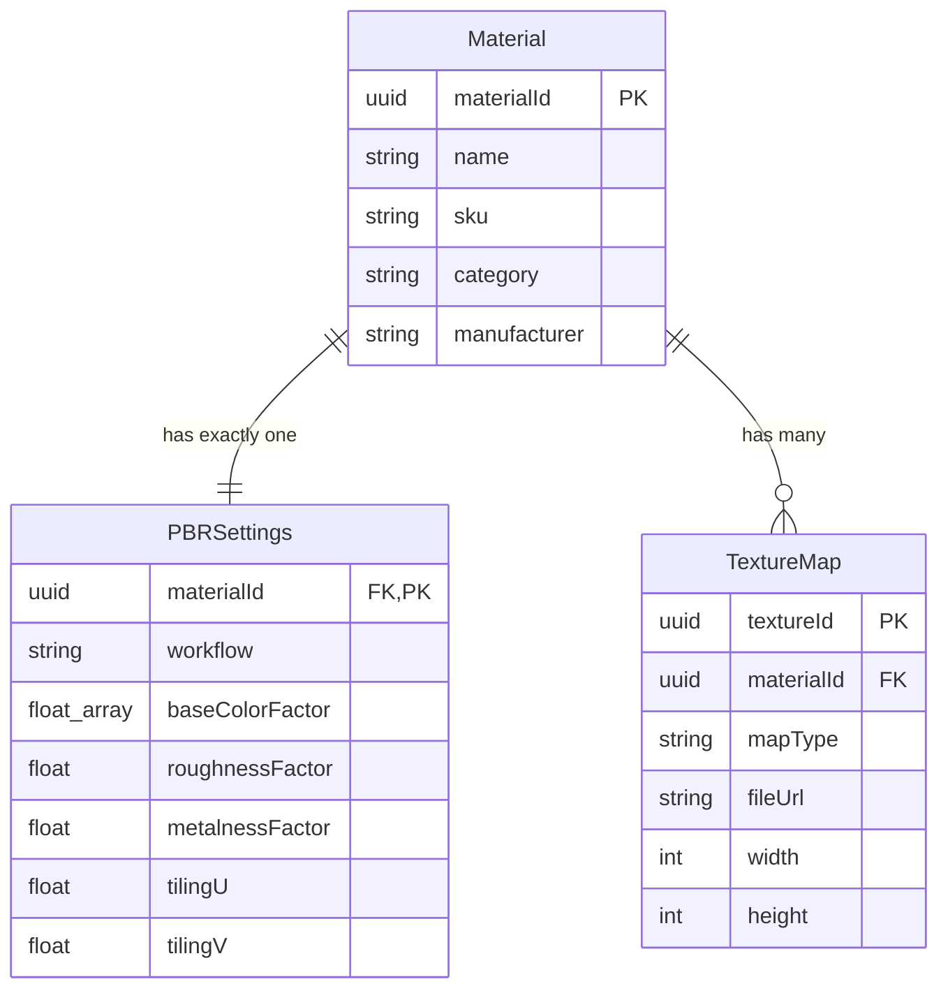
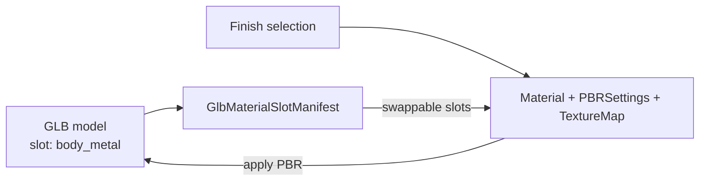
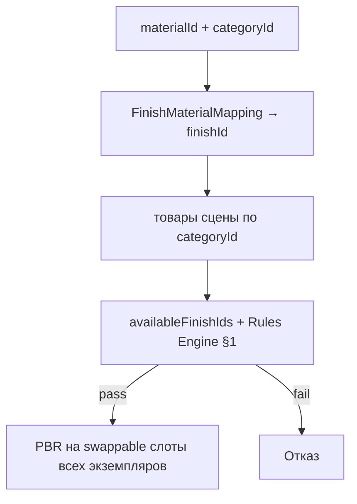

# bathroom-catalog

> **Читайте этот документ.** Русскоязычная версия спецификации каталога ванных комнат.  
> Имена схем, полей, переменных и JSON Schema — на английском (как в коде).  
> Английская версия: [README.md](README.md)

---

## 1. Движок правил (Rules Engine)

### JSON Schemas

1. Collections

```json
{
  "$schema": "https://json-schema.org",
  "title": "Collection",
  "description": "Коллекция изделий (группа товаров одной линейки или стиля)",
  "type": "object",
  "properties": {
    "id": {
      "type": "string",
      "format": "uuid",
      "description": "PRIMARY KEY: Уникальный идентификатор коллекции"
    },
    "name": {
      "type": "string",
      "description": "Название коллекции",
      "example": "Коллекция Loft"
    }
  },
  "required": ["id", "name"]
}
```

2. Category

```json
{
  "$schema": "https://json-schema.org",
  "title": "Category",
  "description": "Категория изделия внутри коллекции",
  "type": "object",
  "properties": {
    "id": {
      "type": "string",
      "format": "uuid",
      "description": "PRIMARY KEY: Уникальный идентификатор категории"
    },
    "name": {
      "type": "string",
      "description": "Название категории",
      "example": "смеситель для раковины, душевая стойка, полотенцесушитель, раковина и т.д"
    },
    "collectionId": {
      "type": "string",
      "format": "uuid",
      "description": "FOREIGN KEY: Ссылка на Collection.id"
    }
  },
  "required": ["id", "name", "collectionId"]
}
```

3. Product

```json
{
  "$schema": "https://json-schema.org",
  "title": "Product",
  "description": "Товар каталога (изделие с базовой ценой и доступными отделками)",
  "type": "object",
  "properties": {
    "id": {
      "type": "string",
      "format": "uuid",
      "description": "PRIMARY KEY: Уникальный идентификатор товара"
    },
    "sku": {
      "type": "string",
      "description": "Артикул производителя",
      "example": "3197305"
    },
    "name": {
      "type": "string",
      "description": "Название товара",
      "example": "смеситель для раковины, душевая стойка, полотенцесушитель, раковина и т.д"
    },
    "baseCost": {
      "type": "string",
      "description": "Базовая стоимость без учёта отделки (упрощённое представление)",
      "example": "$45"
    },
    "collectionId": {
      "type": "string",
      "format": "uuid",
      "description": "FOREIGN KEY: Ссылка на Collection.id"
    },
    "categoryId": {
      "type": "string",
      "format": "uuid",
      "description": "FOREIGN KEY: Ссылка на Category.id"
    },
    "availableFinishIds": {
      "type": "array",
      "description": "Список отделок, доступных для данного товара",
      "items": {
        "type": "string",
        "format": "uuid",
        "description": "FOREIGN KEY: Ссылка на Finish.id"
      }
    }
  },
  "required": ["id", "name", "collectionId", "categoryId", "availableFinishIds"]
}
```

4. Finishes

```json
{
  "$schema": "https://json-schema.org",
  "title": "Finish",
  "description": "Вариант отделки поверхности изделия (финиш)",
  "type": "object",
  "properties": {
    "id": {
      "type": "string",
      "format": "uuid",
      "description": "PRIMARY KEY: Уникальный идентификатор отделки"
    },
    "name": {
      "type": "string",
      "description": "Название отделки",
      "example": "хром, матовый чёрный, золото и др."
    }
  },
  "required": ["id", "name"]
}
```

5. Rules

```json
{
  "$schema": "https://json-schema.org",
  "title": "Rule",
  "description": "Правило совместимости товаров в конфигураторе",
  "type": "object",
  "properties": {
    "id": {
      "type": "string",
      "format": "uuid",
      "description": "PRIMARY KEY: Уникальный идентификатор правила"
    },
    "name": {
      "type": "string",
      "description": "Человекочитаемое описание правила",
      "example": "Смеситель серии A совместим только с раковинами серии B и C"
    },
    "selectedProductId": {
      "type": "string",
      "format": "uuid",
      "description": "FOREIGN KEY: Якорный товар, для которого действует правило"
    },
    "compatibleOnlyProductIds": {
      "type": "array",
      "description": "Белый список: только эти товары можно добавить к якорному",
      "items": {
        "type": "string",
        "format": "uuid",
        "description": "FOREIGN KEY: Ссылка на Product.id"
      }
    },
    "prohibitedProductIds": {
      "type": "array",
      "description": "Чёрный список: эти товары нельзя использовать с якорным",
      "items": {
        "type": "string",
        "format": "uuid",
        "description": "FOREIGN KEY: Ссылка на Product.id"
      }
    },
    "listOfProductCombinations": {
      "type": "array",
      "description": "Обязательные доп. товары при выборе определённой комбинации",
      "items": {
        "type": "object",
        "description": "Комбинация доп. товаров и обязательных к покупке позиций",
        "properties": {
          "additionalSelectedProductIds": {
            "type": "array",
            "description": "Доп. товары, которые выбрал пользователь",
            "items": {
              "type": "string",
              "format": "uuid",
              "description": "FOREIGN KEY: Ссылка на Product.id"
            }
          },
          "requiredProductIds": {
            "type": "array",
            "description": "Товары, которые обязательно нужно добавить в заказ",
            "items": {
              "type": "string",
              "format": "uuid",
              "description": "FOREIGN KEY: Ссылка на Product.id"
            }
          }
        },
        "required": ["additionalSelectedProductIds", "requiredProductIds"]
      }
    }
  },
  "required": ["id", "name", "selectedProductId", "compatibleOnlyProductIds", "prohibitedProductIds", "listOfProductCombinations"]
}
```

### Связи между схемами (ER-диаграмма)



### Структура Rule (назначение полей)



### Типы правил

1. Товар выбирается через `selectedProductId`; можно ограничить совместимые доп. товары через `compatibleOnlyProductIds` — нельзя выбрать товар вне этого списка. `prohibitedProductIds` и `listOfProductCombinations` могут быть пустыми.
2. У каждого товара (`selectedProductId` и из `compatibleOnlyProductIds`) ограничен набор отделок в `availableFinishIds`.
3. Для `selectedProductId` можно задать запрещённые товары в `prohibitedProductIds`. Остальные списки могут быть пустыми.
4. Если пользователь выбирает доп. товары (`listOfProductCombinations.additionalSelectedProductIds`), для комбинации с `selectedProductId` могут требоваться обязательные товары (`requiredProductIds`). Система рассчитана на любое количество товаров в комбинации.

Все правила должны быть согласованы: `prohibitedProductIds` и `compatibleOnlyProductIds` не пересекаются; `listOfProductCombinations` не противоречит другим спискам. Иначе Engine выбрасывает admin error.

### Как Engine проверяет совместимость товаров и отделок

**ВХОД**
1. Пользователь выбирает товар: `input.selectedProductId`.
2. Пользователь **может, а может и не** выбрать доп. товары: `input.additionalSelectedProductIds`.
3. Пользователь выбирает отделку: `input.selectedFinishId`.

**ПРОЦЕСС**
1. Engine фильтрует правила по `input.selectedProductId` и `input.additionalSelectedProductIds`.
2. Engine валидирует каждое правило и все вместе (см. раздел «Разрешение конфликтов»).

Для каждого правила:
1. Берёт `availableFinishIds` товара `input.selectedProductId`.
2. Собирает `availableFinishIds` всех товаров из `input.additionalSelectedProductIds`.
3. Проверяет `compatibleOnlyProductIds` — если доп. товар не в списке, отказ или сообщение о несовместимости.
4. Проверяет `prohibitedProductIds` — при совпадении отказ заказа.
5. Проверяет `listOfProductCombinations` и `requiredProductIds` — при несоответствии требует добавить товары; иначе собирает их `availableFinishIds`.
6. Проверяет, что все товары в комбинации поддерживают `input.selectedFinishId`.
7. Расчёт стоимости с отделками — отдельный процесс, вне scope задачи.

### Перенос бизнес-правила клиента в схему Rule

1. Для каждого товара задаём совместимые товары (коллекция не важа — товар A из коллекции 1 может быть совместим только с B из коллекции 2).
2. У каждого товара — поддерживаемые отделки и `baseCost`.
3. Запрещённые товары — в `prohibitedProductIds`.
4. Обязательные доп. товары при определённых комбинациях — в `listOfProductCombinations.requiredProductIds`.



### Разрешение конфликтов

#### Пустые списки означают
1. Пустой `compatibleOnlyProductIds` — можно выбрать любой доп. товар (если не запрещён).
2. Пустой `prohibitedProductIds` — ничего не блокируется этим правилом.
3. Пустой `listOfProductCombinations` — правило не требует доп. товаров.

#### Проверка отдельного правила (для админов)
1. Товар не может быть одновременно в `compatibleOnlyProductIds` и `prohibitedProductIds`.
2. `selectedProductId` не может быть в `prohibitedProductIds`.
3. `selectedProductId` не должен быть в `compatibleOnlyProductIds`.
4. Товары из `additionalSelectedProductIds` не могут быть в `prohibitedProductIds`.
5. Товары из `requiredProductIds` не могут быть в `prohibitedProductIds`.
6. Если `compatibleOnlyProductIds` не пуст — каждый `additionalSelectedProductIds` должен быть внутри него.
7. Один и тот же набор `additionalSelectedProductIds` не может иметь разные `requiredProductIds`.
8. Все ID товаров в правиле должны существовать в каталоге.

При ошибке — admin error, правило нужно исправить.

#### Два и более правил с одним `selectedProductId` (для админов)
1. Товар из `compatibleOnlyProductIds` одного правила не может быть в `prohibitedProductIds` другого для того же `selectedProductId`.
2. Если у двух правил оба заполнены `compatibleOnlyProductIds` — списки должны иметь хотя бы одно общее пересечение.
3. Два правила не могут требовать разные `requiredProductIds` для одного набора `additionalSelectedProductIds`.
4. Товар, обязательный в одном правиле, не может быть запрещён в другом для того же `selectedProductId`.

При ошибке — admin error, правила нужно исправить.

---

## 2. Конфигурация отделок (Finish Configuration)

### JSON Schemas

1. Material

```json
{
  "$schema": "http://json-schema.org/draft-07/schema#",
  "title": "Material",
  "description": "Основная сущность отделочного материала (Родительская таблица)",
  "type": "object",
  "properties": {
    "materialId": {
      "type": "string",
      "format": "uuid",
      "description": "PRIMARY KEY: Уникальный идентификатор материала"
    },
    "name": {
      "type": "string",
      "description": "Название материала",
      "example": "Дуб Натур Браш"
    },
    "sku": {
      "type": "string",
      "description": "Артикул материала",
      "example": "WD-OAK-042"
    },
    "category": {
      "type": "string",
      "description": "Категория материала (дерево, металл и т.д.)",
      "example": "Дерево / Паркет"
    },
    "manufacturer": {
      "type": "string",
      "description": "Производитель материала",
      "example": "Barlinek"
    }
  },
  "required": ["materialId", "name", "sku", "category", "manufacturer"],
  "additionalProperties": false
}
```

2. PBRSettings

```json
{
  "$schema": "http://json-schema.org/draft-07/schema#",
  "title": "PBRSettings",
  "description": "Физические параметры рендеринга (Связь 1:1 к Material)",
  "type": "object",
  "properties": {
    "materialId": {
      "type": "string",
      "format": "uuid",
      "description": "FOREIGN KEY: Ссылка на Material.materialId"
    },
    "workflow": {
      "type": "string",
      "enum": ["metallicRoughness", "specularGlossiness"],
      "description": "Рабочий процесс PBR-рендеринга",
      "default": "metallicRoughness"
    },
    "baseColorFactor": {
      "type": "array",
      "description": "Базовый цвет материала [R, G, B, A]",
      "minItems": 4,
      "maxItems": 4,
      "items": {
        "type": "number",
        "minimum": 0.0,
        "maximum": 1.0
      },
      "default": [1.0, 1.0, 1.0, 1.0]
    },
    "roughnessFactor": {
      "type": "number",
      "description": "Коэффициент шероховатости (0 — гладкий, 1 — матовый)",
      "minimum": 0.0,
      "maximum": 1.0,
      "default": 0.5
    },
    "metalnessFactor": {
      "type": "number",
      "description": "Коэффициент металличности (0 — диэлектрик, 1 — металл)",
      "minimum": 0.0,
      "maximum": 1.0,
      "default": 0.0
    },
    "tilingU": {
      "type": "number",
      "description": "Повтор текстуры по оси U",
      "default": 1.0
    },
    "tilingV": {
      "type": "number",
      "description": "Повтор текстуры по оси V",
      "default": 1.0
    }
  },
  "required": [
    "materialId",
    "workflow",
    "baseColorFactor",
    "roughnessFactor",
    "metalnessFactor"
  ],
  "additionalProperties": false
}
```

3. TextureMap

```json
{
  "$schema": "http://json-schema.org/draft-07/schema#",
  "title": "TextureMap",
  "description": "Файл текстурной карты (Связь 1:N к Material)",
  "type": "object",
  "properties": {
    "textureId": {
      "type": "string",
      "format": "uuid",
      "description": "PRIMARY KEY: Уникальный ID текстурного файла"
    },
    "materialId": {
      "type": "string",
      "format": "uuid",
      "description": "FOREIGN KEY: Ссылка на Material.materialId"
    },
    "mapType": {
      "type": "string",
      "enum": ["albedo", "normal", "roughness", "metallic", "ambientOcclusion", "displacement"],
      "description": "Тип (канал) текстуры"
    },
    "fileUrl": {
      "type": "string",
      "format": "uri",
      "description": "Прямая ссылка на S3-хранилище",
      "example": "https://storage.yandexcloud.net/assets/oak_normal.jpg"
    },
    "width": {
      "type": "integer",
      "description": "Ширина текстуры в пикселях",
      "minimum": 1,
      "example": 2048
    },
    "height": {
      "type": "integer",
      "description": "Высота текстуры в пикселях",
      "minimum": 1,
      "example": 2048
    }
  },
  "required": ["textureId", "materialId", "mapType", "fileUrl"],
  "additionalProperties": false
}
```

### Диаграмма



### GlbMaterialSlotManifest

**GLB** — бинарный контейнер glTF: единый 3D-ассет (геометрия, материалы, текстуры) для конфигуратора. **Material slots** — именованные поверхности внутри GLB. Имена слотов — контракт между художником (экспорт модели) и разработчиком (подмена отделок в рантайме).

```json
{
  "$schema": "http://json-schema.org/draft-07/schema#",
  "title": "GlbMaterialSlotManifest",
  "description": "Манифест материальных слотов GLB-модели (связь товара с 3D-ассетом и правилами подмены отделок)",
  "type": "object",
  "properties": {
    "manifestId": {
      "type": "string",
      "format": "uuid",
      "description": "PRIMARY KEY: Уникальный идентификатор манифеста"
    },
    "productSku": {
      "type": "string",
      "description": "FOREIGN KEY: Артикул товара (Product.sku), к которому привязана модель"
    },
    "glbUrl": {
      "type": "string",
      "format": "uri",
      "description": "Прямая ссылка на GLB-файл в хранилище",
      "example": "https://storage.yandexcloud.net/models/faucet_loft_3197305.glb"
    },
    "slots": {
      "type": "array",
      "description": "Список материальных слотов модели",
      "minItems": 1,
      "items": {
        "type": "object",
        "title": "MaterialSlot",
        "description": "Один именованный материальный слот в GLB",
        "properties": {
          "slotName": {
            "type": "string",
            "pattern": "^[a-z][a-z0-9]*(_[a-z0-9]+)*$",
            "description": "Имя слота в GLB (materials[].name). Формат: snake_case, латиница, нижний регистр",
            "example": "body_metal"
          },
          "swappable": {
            "type": "boolean",
            "description": "Можно ли подменять отделку на этом слоте при выборе Finish"
          },
          "defaultFinishId": {
            "type": "string",
            "format": "uuid",
            "description": "FOREIGN KEY: Отделка по умолчанию (Finish.id). Обязательна, если swappable = true"
          }
        },
        "required": ["slotName", "swappable"],
        "additionalProperties": false
      }
    }
  },
  "required": ["manifestId", "productSku", "glbUrl", "slots"],
  "additionalProperties": false
}
```

Пример:

```json
{
  "manifestId": "a1b2c3d4-e5f6-7890-abcd-ef1234567890",
  "productSku": "3197305",
  "glbUrl": "https://storage.yandexcloud.net/models/faucet_loft_3197305.glb",
  "slots": [
    { "slotName": "body_metal", "swappable": true, "defaultFinishId": "f1a2b3c4-d5e6-7890-abcd-ef1234567890" },
    { "slotName": "handle_metal", "swappable": true, "defaultFinishId": "f1a2b3c4-d5e6-7890-abcd-ef1234567890" },
    { "slotName": "spout_metal", "swappable": true, "defaultFinishId": "f1a2b3c4-d5e6-7890-abcd-ef1234567890" },
    { "slotName": "aerator_plastic_fixed", "swappable": false }
  ]
}
```

### Конвенция именования

| Правило | Хорошо | Плохо |
|---|---|---|
| Английский, lowercase, `snake_case` | `body_metal` | `Material.001`, `Chrome_Body` |
| Имя по **роли**, не по отделке | `handle_metal` | `chrome_handle`, `gold_body` |
| Подменяемые слоты: суффикс `_metal` или `_finish` | `spout_metal` | `spout` |
| Фиксированные слоты: суффикс `_fixed` | `basin_ceramic_fixed` | `basin_white` |
| Одинаковые имена слотов в серии | все смесители: `body_metal` | `body` на одной модели, `Body_Metal` на другой |

### Логика работы

**Художник**
1. Разделить модель на материальные регионы, назначить placeholder-материалы с согласованными именами слотов.
2. Экспорт в GLB (glTF 2.0, PBR metallic-roughness). Каждый `materials[].name` = `slotName` в манифесте.
3. Передать GLB вместе с `GlbMaterialSlotManifest` для SKU товара.
4. Не вшивать названия отделок в имена слотов — отделка задаётся в рантайме из каталога `Finish` / `Material`.

**Разработчик**
1. Загрузить GLB, прочитать `materials[].name` из glTF-сцены.
2. Загрузить `GlbMaterialSlotManifest` по `productSku`, провалидировать: все `slotName` есть в GLB; нет безымянных материалов (`Material.001`).
3. При смене отделки: для `swappable === true` — `selectedFinishId` → `Material` + `PBRSettings` + `TextureMap[]` → применить к слоту.
4. Слоты с `swappable === false` или суффиксом `_fixed` не перезаписываются.
5. Отклонять ассет на CI / админ-ревью при расхождении манифеста и GLB.

**Поток в рантайме**



### Механизм применения

Пользователь выбирает **материал** (`materialId`). Система связывает его с `Finish`, проверяет совместимость через Rules Engine (§1), применяет PBR ко всем подходящим экземплярам в сцене одновременно.

**1. FinishMaterialMapping** — связь материала рендера с отделкой каталога:

```json
{
  "$schema": "http://json-schema.org/draft-07/schema#",
  "title": "FinishMaterialMapping",
  "description": "Связь Material ↔ Finish (materialId на входе → finishId для проверок)",
  "type": "object",
  "properties": {
    "finishId": {
      "type": "string",
      "format": "uuid",
      "description": "FOREIGN KEY: Ссылка на Finish.id"
    },
    "materialId": {
      "type": "string",
      "format": "uuid",
      "description": "FOREIGN KEY: Ссылка на Material.materialId"
    }
  },
  "required": ["finishId", "materialId"],
  "additionalProperties": false
}
```

**2. ApplyMaterialToScene** — вход для применения по всей сцене:

```json
{
  "$schema": "http://json-schema.org/draft-07/schema#",
  "title": "ApplyMaterialToScene",
  "description": "Применение материала ко всем товарам нужного типа в сцене",
  "type": "object",
  "properties": {
    "materialId": {
      "type": "string",
      "format": "uuid",
      "description": "FOREIGN KEY: Выбранный материал (Material.materialId)"
    },
    "categoryId": {
      "type": "string",
      "format": "uuid",
      "description": "FOREIGN KEY: Тип товаров в сцене (Category.id), напр. все смесители"
    },
    "selectedProductId": {
      "type": "string",
      "format": "uuid",
      "description": "FOREIGN KEY: Якорный товар заказа (для Rules Engine)"
    },
    "additionalSelectedProductIds": {
      "type": "array",
      "description": "Доп. товары в заказе",
      "items": { "type": "string", "format": "uuid" }
    },
    "sceneProductIds": {
      "type": "array",
      "description": "Товары, размещённые в 3D-сцене",
      "items": {
        "type": "string",
        "format": "uuid",
        "description": "FOREIGN KEY: Ссылка на Product.id"
      }
    }
  },
  "required": ["materialId", "categoryId", "selectedProductId", "additionalSelectedProductIds", "sceneProductIds"],
  "additionalProperties": false
}
```

**Поведение**
1. `materialId` → `FinishMaterialMapping` → `finishId`.
2. Отфильтровать `sceneProductIds`, где `Product.categoryId === categoryId`.
3. **Совместимость**: для каждого товара `finishId` ∈ `Product.availableFinishIds`; вызвать Rules Engine (§1) с `selectedFinishId = finishId` — при отказе остановиться.
4. **Применение**: для каждого совместимого экземпляра загрузить `GlbMaterialSlotManifest` → `Material` + `PBRSettings` + `TextureMap[]` → применить ко всем `swappable` слотам за один проход.



### Расширяемость (новая отделка только через конфиг)

Аппликатор, проверки правил и загрузчик GLB **не зависят от конкретной отделки** — читают конфиг в рантайме. Новая отделка = новые записи, без деплоя кода.

**Чеклист — что добавить при новой отделке (напр. «Брашированный никель»):**

| # | Запись конфига | Схема | Обяз.? | Зачем |
|---|---|---|---|---|
| 1 | `Finish` | §1 | да | Запись в каталоге для выбора |
| 2 | `Material` | §2 | да | Данные для 3D-рендера |
| 3 | `PBRSettings` | §2 | да | Шероховатость, металличность, цвет, тайлинг |
| 4 | `TextureMap[]` | §2 | да* | Albedo, normal, roughness и т.д. (*или только `baseColorFactor`) |
| 5 | `FinishMaterialMapping` | выше | да | Связь `finishId` ↔ `materialId` |
| 6 | `Product.availableFinishIds` | §1 | да | Добавить `finishId` каждому поддерживающему товару |

**Не требуется**
- Переэкспорт GLB — имена слотов (`body_metal`, …) не меняются
- Изменения `GlbMaterialSlotManifest` — только `defaultFinishId`, если новая отделка стала дефолтной
- Изменения кода — рендерер обрабатывает любой `materialId` одинаково
- Изменения `Rule` — только если меняется логика совместимости товаров

**Пример — минимальный конфиг-бандл:**

```json
{
  "finish": {
    "id": "f-new-001",
    "name": "Брашированный никель"
  },
  "material": {
    "materialId": "m-new-001",
    "name": "Brushed Nickel PBR",
    "sku": "MT-BN-001",
    "category": "Металл",
    "manufacturer": "In-house"
  },
  "pbrSettings": {
    "materialId": "m-new-001",
    "workflow": "metallicRoughness",
    "baseColorFactor": [0.75, 0.75, 0.72, 1.0],
    "roughnessFactor": 0.45,
    "metalnessFactor": 1.0
  },
  "textureMaps": [
    { "textureId": "t-001", "materialId": "m-new-001", "mapType": "albedo", "fileUrl": "https://storage.example.com/bn_albedo.jpg" },
    { "textureId": "t-002", "materialId": "m-new-001", "mapType": "normal", "fileUrl": "https://storage.example.com/bn_normal.jpg" }
  ],
  "finishMaterialMapping": {
    "finishId": "f-new-001",
    "materialId": "m-new-001"
  },
  "productsToUpdate": [
    { "productId": "p-faucet-loft", "availableFinishIds": ["…existing…", "f-new-001"] }
  ]
}
```

**Поведение**
1. Админ загружает конфиг → отделка появляется в пикере для нужных товаров.
2. Пользователь выбирает материал → срабатывает `ApplyMaterialToScene`.
3. Один пайплайн для любой отделки: mapping → совместимость → PBR.

### Связь с Rules Engine (§1)

1. **Источник ограничений** — `Product.availableFinishIds` (§1) задаёт поддерживаемые отделки каждого товара.
2. **UI-пикер** — показывать только отделки из пересечения `availableFinishIds` **всех** товаров текущего заказа (`selectedProductId` + `additionalSelectedProductIds`).
3. **materialId → finishId** — перед проверками через `FinishMaterialMapping`.
4. **Вход Engine** — `selectedProductId`, `additionalSelectedProductIds`, `selectedFinishId` (как в §1).
5. **Сначала правила товаров** — `compatibleOnlyProductIds`, `prohibitedProductIds`, `listOfProductCombinations` (без изменений).
6. **Проверка отделки** — `selectedFinishId` ∈ `availableFinishIds` якоря, доп. товаров и `requiredProductIds`.
7. **Шлюз применения** — `ApplyMaterialToScene` только при pass от Engine; иначе блокировка и сообщение.
8. **Проверка по экземплярам** — каждый товар в сцене должен иметь `finishId` в своём `availableFinishIds`.
9. **Без дублирования логики** — §2 делегирует §1 Engine, затем применяет PBR.
